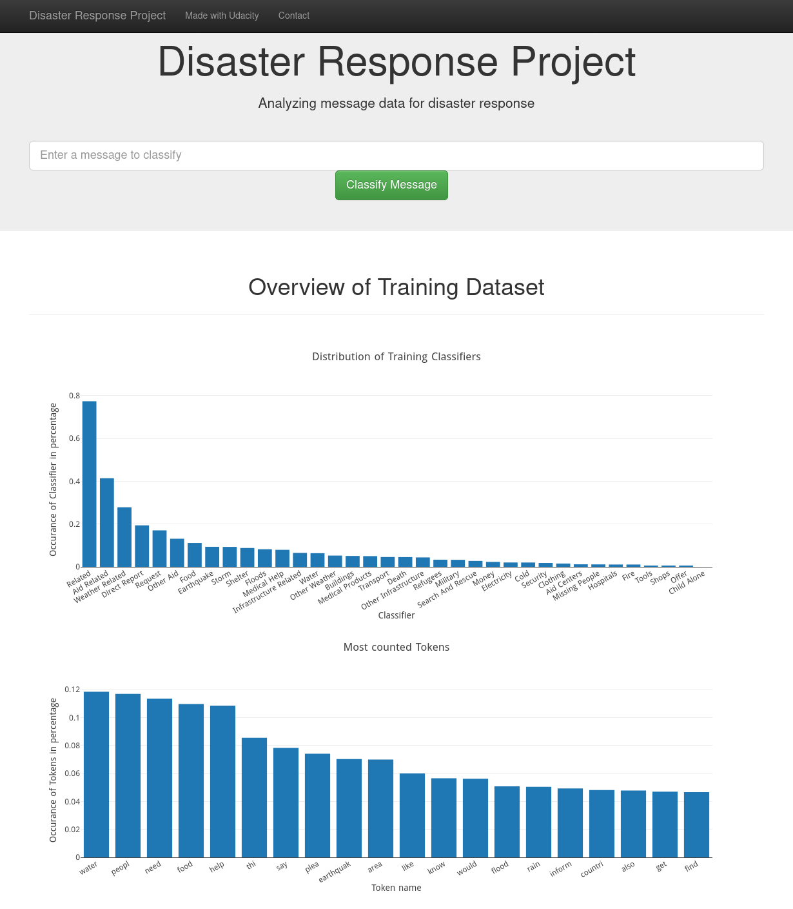
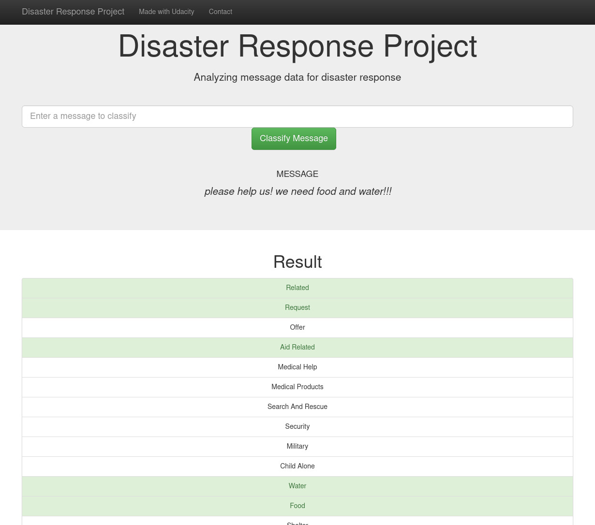

# Disaster Response Pipeline Project

## Description

In this project, you analyze disaster data from Figure Eight to build a model for an API that classifies disaster messages.

The Project Workspace contains real messages that were sent during disaster events.

The project includes a simple flask web app where an emergency worker can input a new message
and get classification results in several categories. The web app will also display
visualizations of the data.

Some screenshots:




## Prerequisites

All scripts and python source codes are tested under osx and linux only.

### Initialize the python environment

You do not want to polute your local environment with new
python libraries. Instead you should create a virtual python environment
in the current directory. The only requirement is that python3 is
preinstalled on your local system. Then just run:

```sh
python3 -m venv venv
```

And activate the virtual environment in your current shell:

```sh
source ./venv/bin/activate
```

Now you can install the needed python libraries:

```sh
pip install --upgrade pip
pip install pylint
pip install autopep8
pip install pandas
pip install jupyterlab
pip install matplotlib
pip install plotly
pip install scikit-learn
pip install nltk
pip install SQLAlchemy
pip install flask
```

## Instructions:

1. Run the following commands in the project's app directory to set up your database and model.

    - To run ETL pipeline that cleans data and stores in database
        ```sh
        python process_data.py data/disaster_messages.csv data/disaster_categories.csv data/DisasterResponse.db
        ```
    - To run ML pipeline that trains classifier and saves
        ```sh
        python train_classifier.py data/DisasterResponse.db models/model.pkl
        ```

2. Run the following command in the app's directory to run your web app.
    `python run.py`

3. Go to <http://127.0.0.1:3001/>

